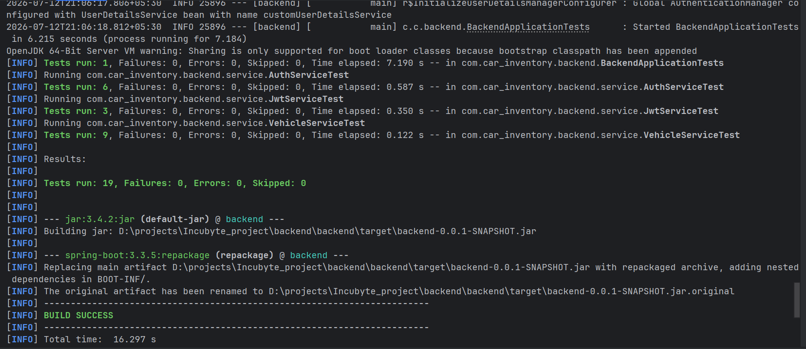
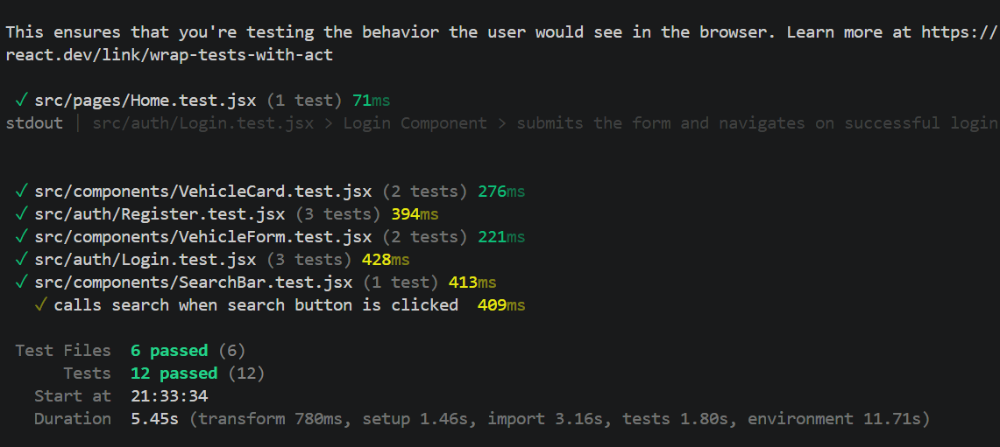
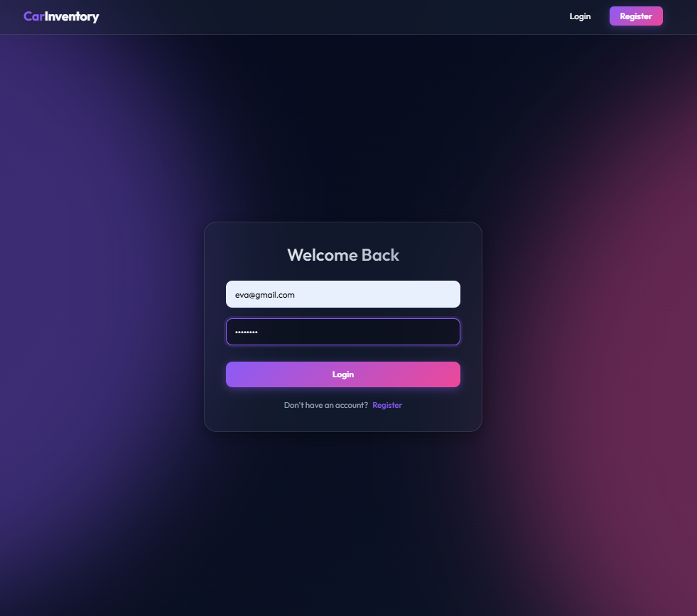
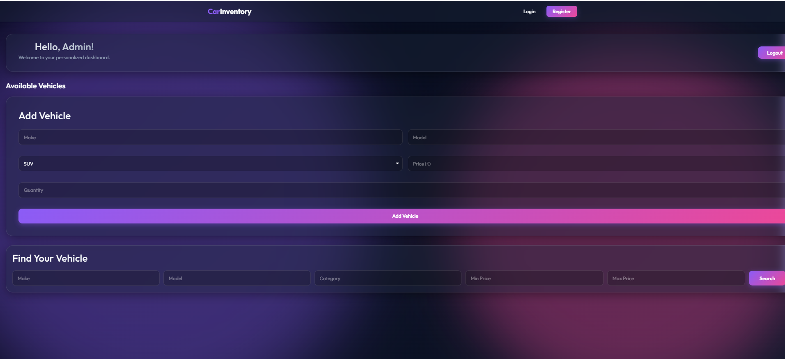
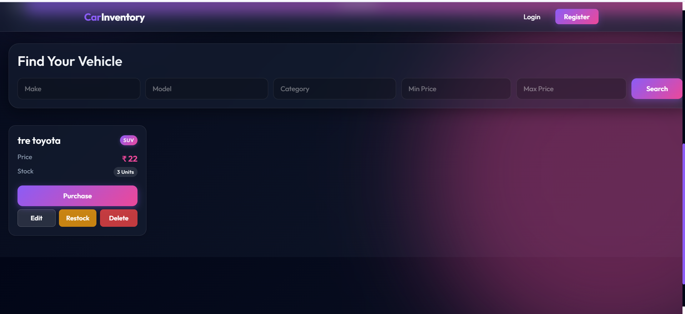

# 🚗 Car Inventory Management System

A full-stack **Car Inventory Management System** developed as part of the **Incubyte AI Assignment**.

The application enables customers to browse, search, and purchase vehicles while allowing administrators to manage the dealership inventory through a secure dashboard.

The backend was developed using **Test-Driven Development (TDD)** with Spring Boot, while the frontend was built using **React (Vite)** and enhanced with AI-assisted UI design.

---

# ✨ Features

## 🔐 Authentication

- User Registration
- User Login
- JWT Authentication
- BCrypt Password Encryption
- Role-based Authorization (USER / ADMIN)
- Protected API Endpoints
- Persistent Login using JWT

---

## 🚘 Vehicle Management

### Customer

- View all vehicles
- Search vehicles by:
    - Make
    - Model
    - Category
    - Minimum Price
    - Maximum Price
- Purchase vehicle
- Automatic quantity update after purchase

### Administrator

- Add new vehicle
- Update vehicle details
- Delete vehicle
- Restock vehicle inventory
- Manage complete inventory

---

# 🛠 Tech Stack

## Backend

- Java 17
- Spring Boot
- Spring Security
- Spring Data JPA
- Hibernate
- MySQL
- JWT (JJWT)
- Maven
- Lombok
- JUnit 5
- Mockito

---

## Frontend

- React
- Vite
- React Router DOM
- Axios
- React Toastify
- CSS

---

# 📂 Project Structure

```
CarInventorySystem
│
├── backend
│   ├── src
│   │   ├── config
│   │   ├── controller
│   │   ├── dto
│   │   ├── entity
│   │   ├── exception
│   │   ├── repository
│   │   ├── security
│   │   └── service
│   │
│   ├── pom.xml
│   └── Dockerfile
│
└── frontend
    ├── src
    │   ├── api
    │   ├── auth
    │   ├── components
    │   ├── pages
    │   ├── styles
    │   └── App.jsx
    │
    ├── package.json
    └── vite.config.js
```

---

# 🏗 Backend Architecture

```
Authentication
│
├── Controller
├── DTO
├── Service
├── Repository
└── Security

Vehicle
│
├── Controller
├── DTO
├── Service
├── Repository
└── Entity

Configuration

Exception Handling

JWT Security
```

The project follows a layered architecture separating responsibilities into Controllers, Services, Repositories, DTOs, and Security components.

---

# 🔑 REST APIs

## Authentication

### Register

```
POST /api/auth/register
```

### Login

```
POST /api/auth/login
```

Returns

```
JWT Token
User Details
User Role
```

---

## Vehicles

### Get All Vehicles

```
GET /api/vehicles
```

---

### Search Vehicles

```
GET /api/vehicles/search
```

Supported Parameters

- make
- model
- category
- minPrice
- maxPrice

---

### Purchase Vehicle

```
POST /api/vehicles/{id}/purchase
```

---

## Administrator APIs

### Add Vehicle

```
POST /api/vehicles
```

### Update Vehicle

```
PUT /api/vehicles/{id}
```

### Delete Vehicle

```
DELETE /api/vehicles/{id}
```

### Restock Vehicle

```
POST /api/vehicles/{id}/restock
```

---

# 🔒 Security

Authentication is implemented using **JWT**.

### Public APIs

- Register
- Login
- Health Endpoint

### Authenticated APIs

- View Vehicles
- Search Vehicles
- Purchase Vehicle

### Administrator Only

- Add Vehicle
- Update Vehicle
- Delete Vehicle
- Restock Vehicle

Method-level security is implemented using Spring Security's `@PreAuthorize`.

---

# 🧪 Testing

Backend development followed a **Test-Driven Development (TDD)** approach.

Implemented using:

- JUnit 5
- Mockito

Test coverage includes:

- User Registration
- User Login
- Password Encryption
- Vehicle CRUD
- Purchase
- Restock
- Search
- Exception Scenarios




---

# 🚀 Running the Project

## Clone Repository

```bash
git clone https://github.com/eva-raste/Incubyte_car_dealership_inventory_system
```

---

## Backend

```bash
cd backend
```

Install dependencies

```bash
mvn clean install
```

Run

```bash
mvn spring-boot:run
```

Backend runs at

```
http://localhost:8080
```

---

## Frontend

```bash
cd frontend
```

Install dependencies

```bash
npm install
```

Run

```bash
npm run dev
```

Frontend runs at

```
http://localhost:5173
```

---

# 🐳 Deployment

Backend

- Docker
- Render

Frontend

- Vercel

---

# 📸 Screenshots






---

# 🤖 AI Usage

This project was developed with AI assistance while ensuring all architectural decisions, implementation details, and debugging were manually validated.

### AI Tools Used

- ChatGPT
- Antigravity

### AI Assistance Included

- Project planning
- Test case generation
- Backend TDD workflow
- Debugging Spring Boot issues
- JWT authentication implementation
- UI enhancement suggestions
- Deployment guidance
- Documentation review

All generated code was reviewed, modified where necessary, and integrated manually.

---

# 📚 Learnings

During this project I strengthened my understanding of:

- Spring Boot
- Spring Security
- JWT Authentication
- Role-based Authorization
- Test-Driven Development
- Mockito
- REST API Design
- React Component Design
- Frontend & Backend Integration
- Docker
- Deployment using Render & Vercel

---

# 🔮 Future Enhancements

- Vehicle Images
- Pagination
- Sorting
- Purchase History
- Dashboard Analytics
- Refresh Tokens
- Email Verification
- CI/CD Pipeline
- Docker Compose
- Cloud Database Integration

---

# 👩‍💻 Author

**Eva Raste**

B.Tech Computer Engineering Student

Backend Developer | Java | Spring Boot | React